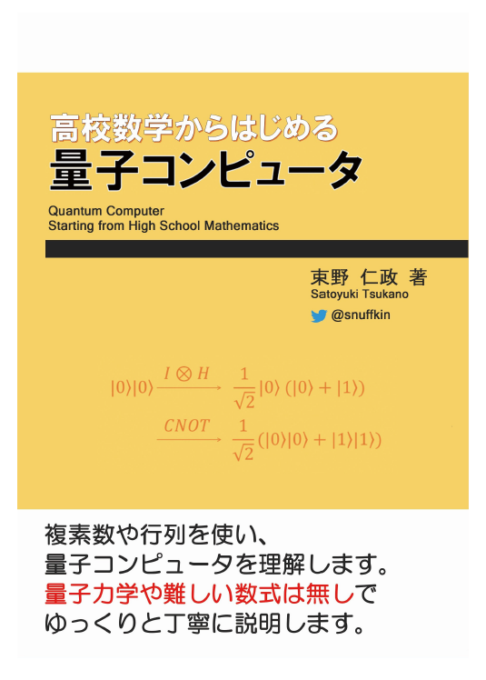
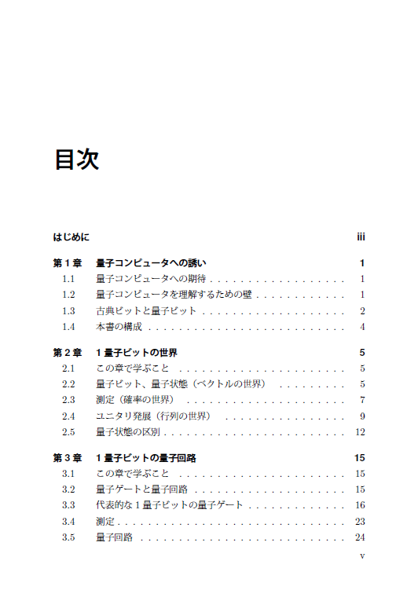
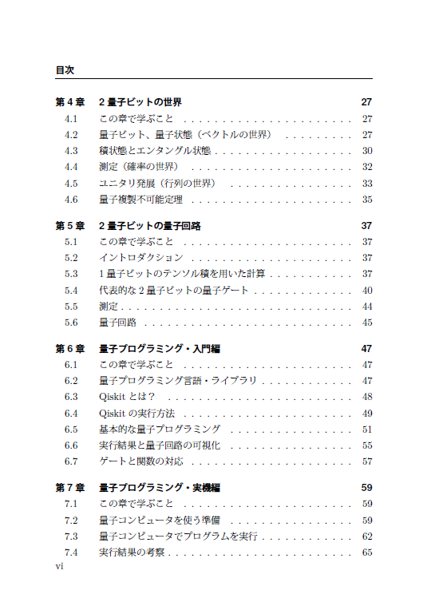
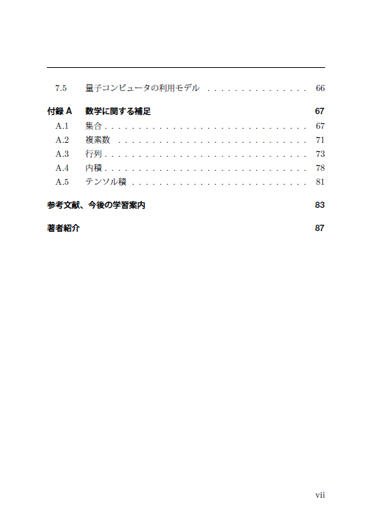

# 「高校数学からはじめる量子コンピュータ」

このページは、「高校数学からはじめる量子コンピュータ」(2019/04/14開催の技術書典6で頒布)に関する情報をまとめたものです。

## 本書の概要
話題に挙がることが増えている量子コンピュータですが、私たち一般のエンジニアが理解するには敷居が高いのが現状です。一方で、数十年後には一般のエンジニアも利用する技術になるかもしれず、理解する人が増えることで大きく発展するのではないかと期待しています。  
そこで、本書では最小限の数式は使いつつ、より多くの人が理解できるようにゆっくり丁寧に量子コンピュータを理解します。  
量子コンピュータはいくつかのルールを理解すれば、豊かな理論を導くことができます。本書をきっかけに、ひとりでも多くの「普通の人」が量子コンピュータに興味を持ち、学ぶきっかけになれば幸いです。

## 電子版
電子版は次のサイトで購入できます。  
[snuffkin's shop(https://snuffkin.booth.pm/)](https://snuffkin.booth.pm/)

## 正誤表
[errata.md](errata.md)

## ソースコード
[ソースコード(Notebook形式)](notebooks)

## 表紙と目次

