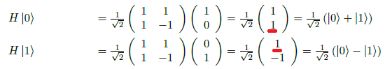
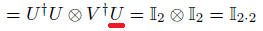
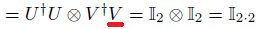

# 「高校数学からはじめる量子コンピュータ」正誤表

|頁|誤|正|
|:--|:--|:--|
|p.17 1行目と2行目|||
|p.35 下から7行目(3行並んだ数式の2行目)|||
|p.55 6行目(リスト6.3の直後)|リスト6.2は、|リスト6.3は、|
|p.75 6行目|n正方行列Aに対し、|n次正方行列Aに対し、|
|p.75 8行目|n正方行列Bが存在するとき、|n次正方行列Bが存在するとき、|
