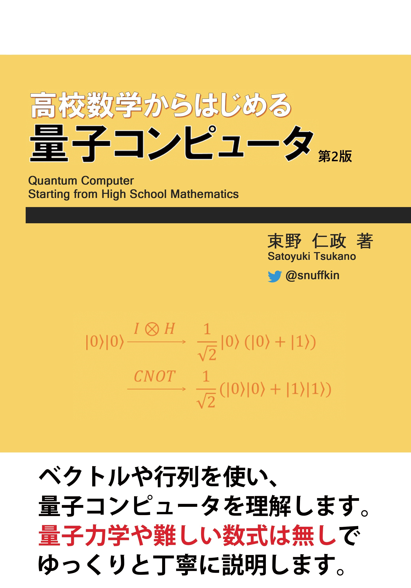
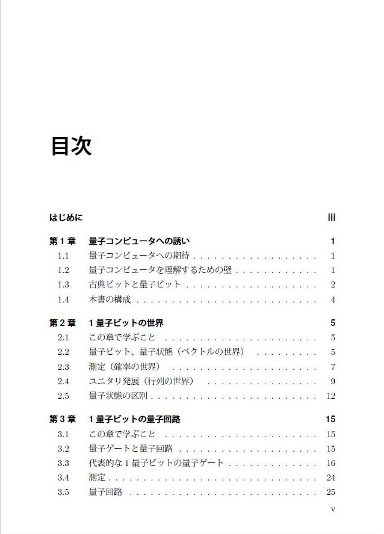
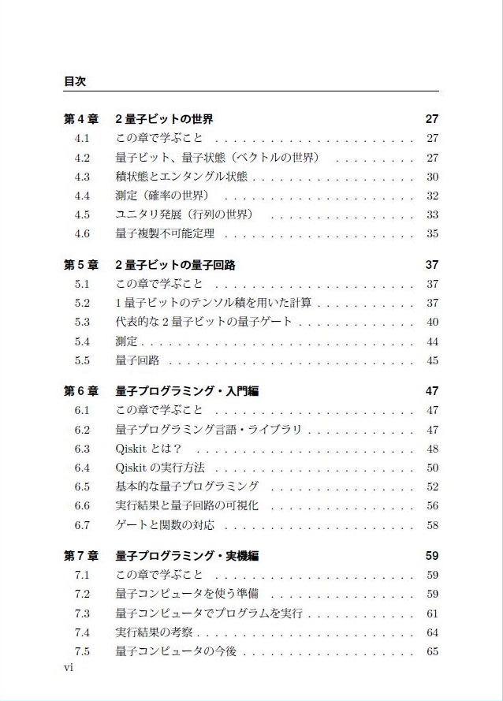
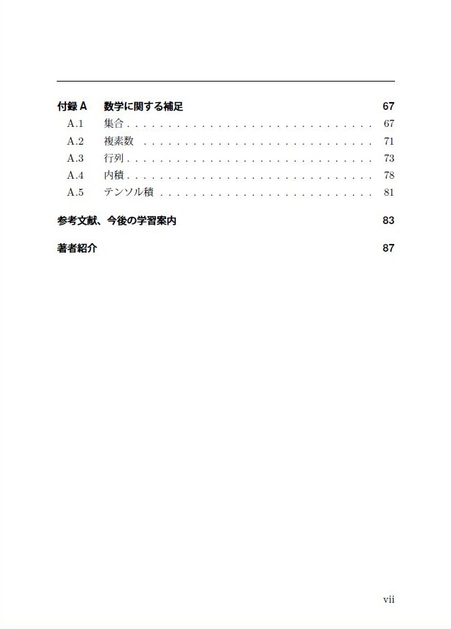

# 「高校数学からはじめる量子コンピュータ」(第2版)

このページは、「高校数学からはじめる量子コンピュータ」(第2版)に関する情報をまとめたものです。

## 本書の概要
話題に挙がることが増えている量子コンピュータですが、実際に理解しようとすると難しく感じる方もいらっしゃるのが現状です。

- ビジネス書では、理解した気になれない。
- 専門書だと、数式が難しくて理解できない。

本書では手計算やPythonで動作を確認しながら、ゆっくりと丁寧に量子コンピュータを理解します。
最終章では、実際に量子コンピュータの実機を使い自作プログラムを動かします。

量子コンピュータはいくつかのルールを理解すれば、豊かな理論を導くことができます。ひとりでも多くの「普通の人」が量子コンピュータに興味を持ち、学ぶきっかけになれば幸いです。

## 著者紹介
束野 仁政(つかの さとゆき)[@snuffkin](https://twitter.com/snuffkin)

- CQ出版社Interface誌にて、量子コンピュータの入門記事「動かしながら始める量子コンピュータ」を連載。
- インプレスR&D社から、検索・分析ミドルウェアElasticsearchに関する書籍「Elasticsearch NEXT STEP」を出版(共著)。

## 電子版
電子版は次のサイトでご購入頂けます。  
[snuffkin's shop(https://snuffkin.booth.pm/)](https://snuffkin.booth.pm/)

## 正誤表
[errata.md](errata.md)

## ソースコード
[ソースコード(Notebook形式)](notebooks)

## 表紙と目次

