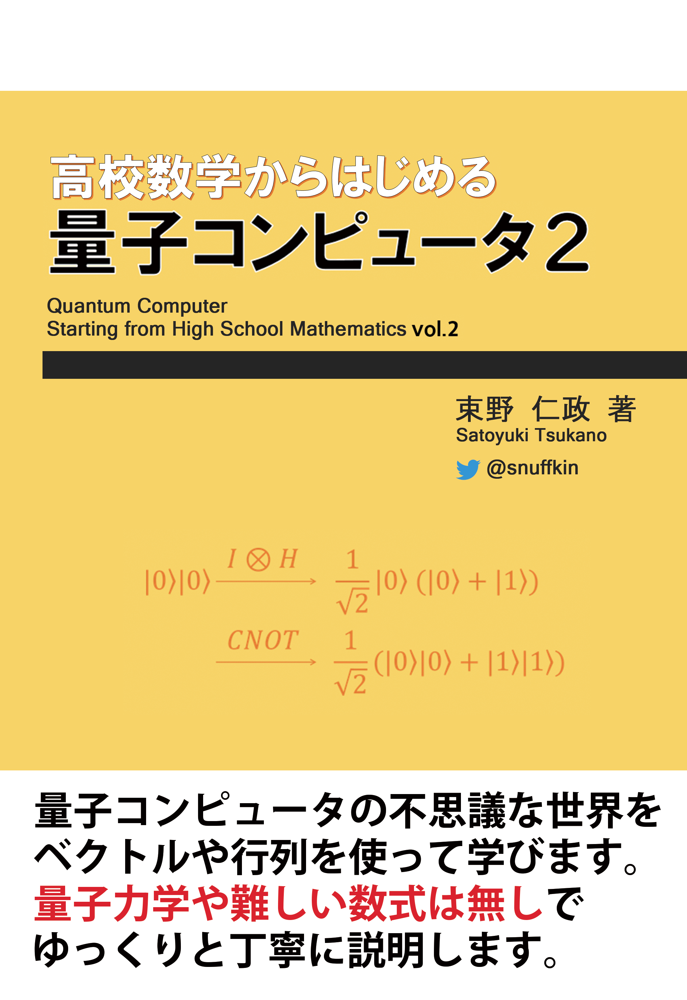
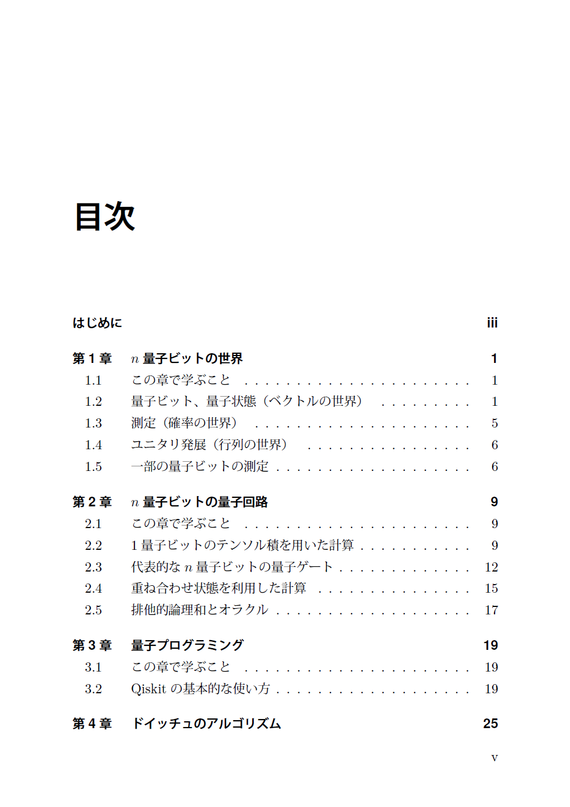
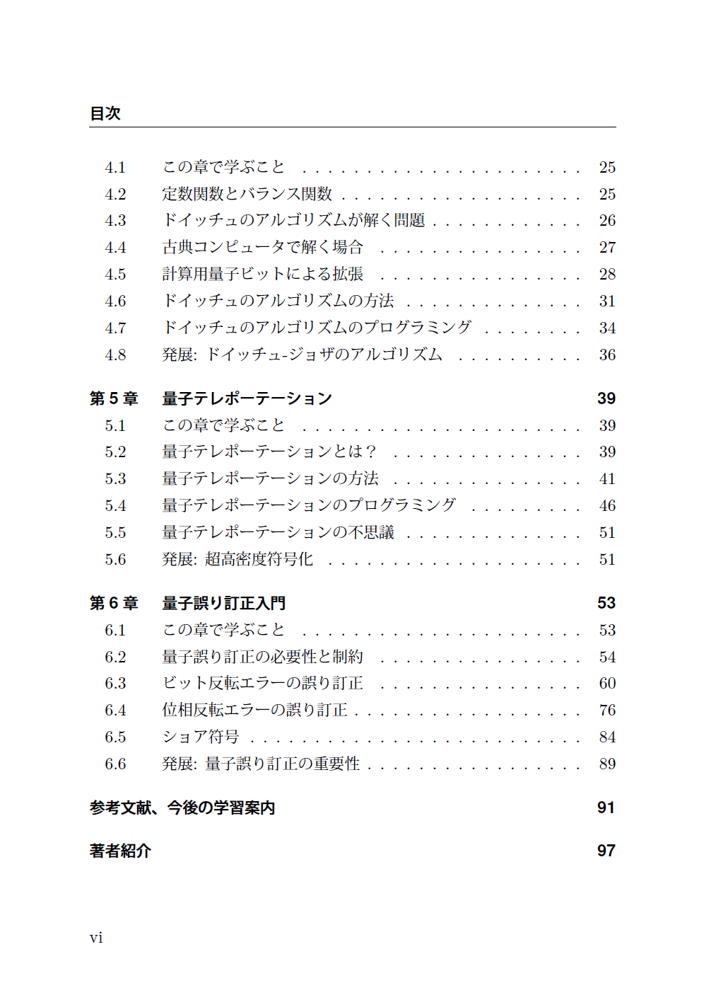

# 「高校数学からはじめる量子コンピュータ2」

このページは、「高校数学からはじめる量子コンピュータ2」に関する情報をまとめたものです。

## 本書の概要
前書「高校数学からはじめる量子コンピュータ」では、量子コンピュータの基本的なルールについて説明しました。
ただ、ページ数の関係もあり、量子コンピュータを使ったアルコリズムについては紹介できませんでした。

本書では具体的なアルコリズムについても紹介し、不思議さ・面白さを楽しみます。
また、前書に引き続き、手計算やPythonで動作を確認しながら、ゆっくりと丁寧に量子コンピュータを理解します。

## 著者紹介
束野 仁政(つかの さとゆき)[@snuffkin](https://twitter.com/snuffkin)

- プログラマ、システム・エンジニアとして働いたのち、研究機関で量子コンピュータ・プログラマとして活動している。
- CQ出版社Interface誌にて、量子コンピュータの入門記事「動かしながら始める量子コンピュータ」を連載。
- インプレスR&D社から、検索・分析ミドルウェアElasticsearchに関する書籍「Elasticsearch NEXT STEP」を出版(共著)。

## 電子版
電子版は次のサイトでご購入頂けます。  
[snuffkin's shop(https://snuffkin.booth.pm/)](https://snuffkin.booth.pm/)

## 正誤表
[errata.md](errata.md)

## ソースコード

## 表紙と目次

