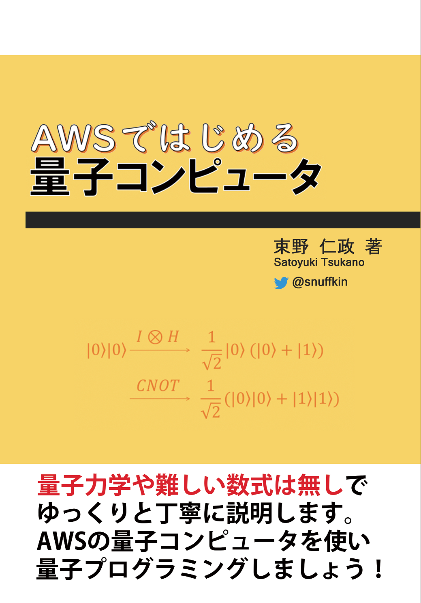
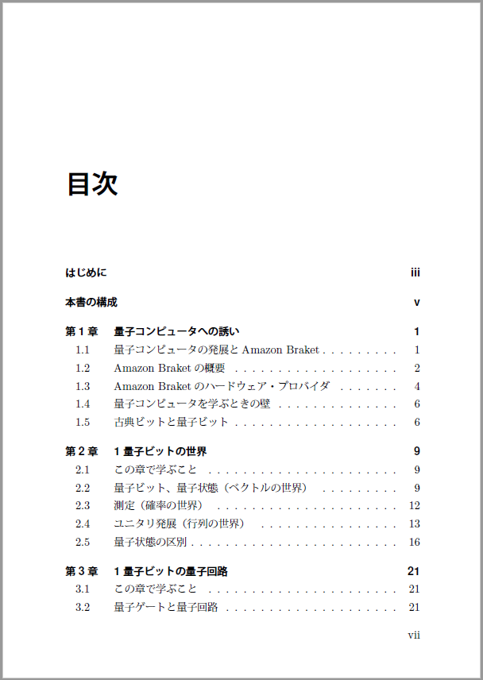
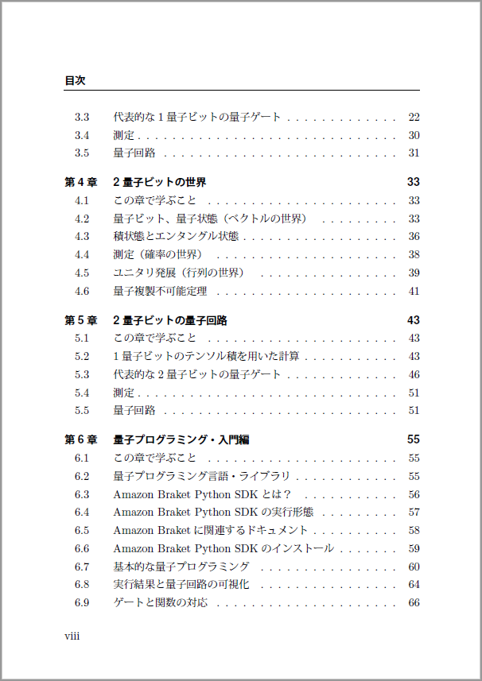
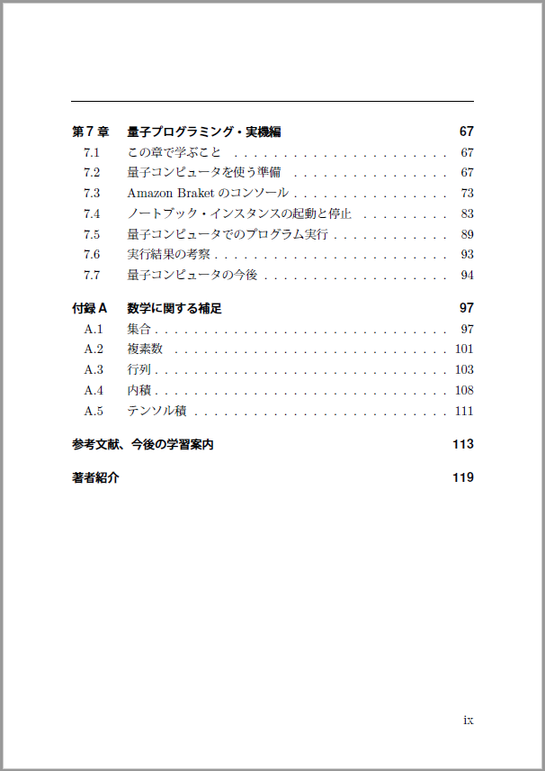

# 「AWSではじめる量子コンピュータ」

このページは、「AWSではじめる量子コンピュータ」に関する情報をまとめたものです。

## 本書の概要
話題に挙がることが増えている量子コンピュータですが、実際に理解しようとすると難しく感じる方もいらっしゃるのが現状です。
- ビジネス書では、理解した気になれない。
- 専門書だと、数式が難しくて理解できない。

本書では手計算やPythonで動作を確認しながら、ゆっくりと丁寧に量子コンピュータを理解します。
最終章では、2020年8月に一般公開されたAWSの量子コンピュータを使い、自作プログラムを動かします。

※本書は既刊「高校数学からはじめる量子コンピュータ」をAmazon Braketに沿った内容に改訂したものです。

## 著者紹介
束野 仁政(つかの さとゆき)[@snuffkin](https://twitter.com/snuffkin)

- プログラマ、システム・エンジニアとして働いたのち、研究機関で量子コンピュータ・プログラマとして活動している。
- CQ出版社Interface誌にて、量子コンピュータの入門記事「動かしながら始める量子コンピュータ」を連載。
- 量子コンピュータの面白さを多くの人に広めたいと考え、雑誌記事や同人誌の執筆、勉強会での発表等を行っている。

## 電子版
電子版は次のサイトでご購入頂けます。  
[snuffkin's shop(https://snuffkin.booth.pm/)](https://snuffkin.booth.pm/)

## 正誤表
[errata.md](errata.md)

## ソースコード
[ソースコード(Notebook形式)](notebooks)

## 表紙と目次

